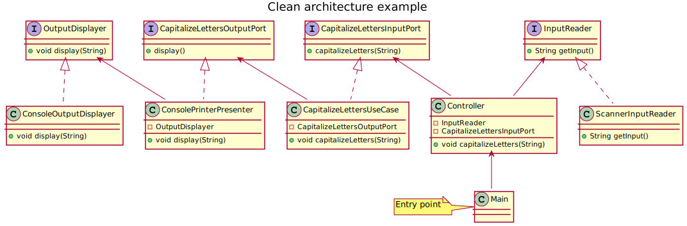

# Clean Architecture Example

Example of a Clean Architecture for a simple program that makes a user input in capital letters.

The `Controller` does not implement any interface.

The `CapitalizeLettersUseCase` needs to read from an input and produce an output. Therefore:
- has an instance of `CapitalizeLettersOutputPort` to be used to render the result
- implements `CapitalizeLettersInputPort` so that the controller can pass the input to it when calling its method.

